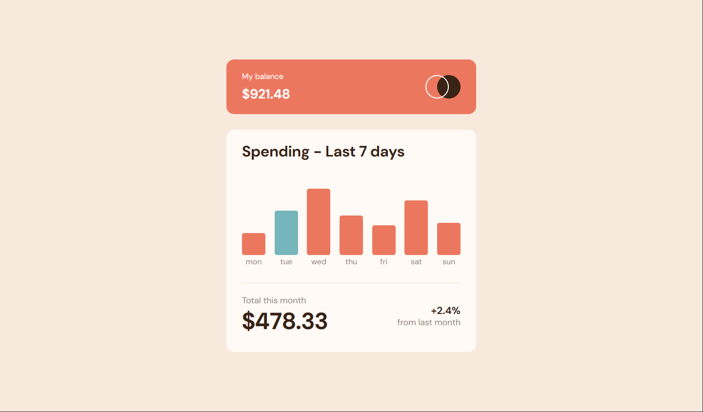
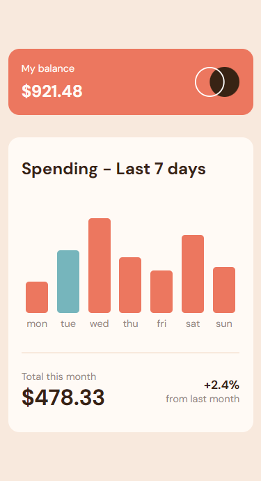

# Expenses Chart Component

*Caption: Desktop view of the Expenses Chart Component*

*Caption: Mobile view of the Expenses Chart Component*

I created an **Expenses Chart Component** as part of the [Frontend Mentor](https://www.frontendmentor.io/challenges/expenses-chart-component-e7yJBUdjwt) challenge. This component provides an elegant solution for visualizing weekly expenses, with responsive design and interactive features.

## Link

You can see a live demo of the **Expenses Chart Component** [here](https://lawrpunk.github.io/expenses-chart/).

## Features

- Responsive design for both desktop and mobile.
- Hover over a bar to view spending details for a specific day but for mobile click it
- See the current day's bar highlighted in a different colour to the other bars.
- Customize the expenses by editing the `data.json` file, and watch the bar chart update dynamically.

## Technologies Used

- HTML
- CSS
- JavaScript

## Usage

To customize expenses:
1. Open the `data.json` file.
2. Modify the amount.
3. Save the file and observe how the chart updates accordingly.

## Acknowledgments

- [Frontend Mentor](https://www.frontendmentor.io/) for the challenge

